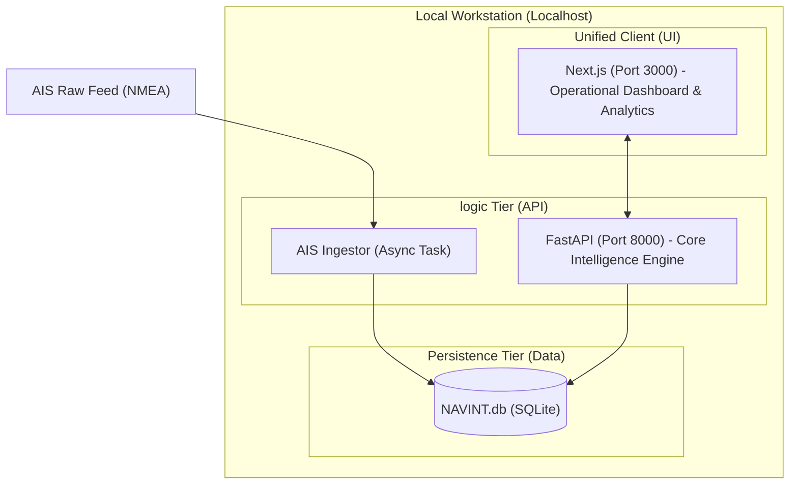

# NAVINT - Architecture Design Document
## Local Standalone Maritime Intelligence Suite

**Classification:** USO OFICIAL  
**Version:** 1.1 (Unified Next.js)  
**Project Category:** WEB / TOOL  
**Tech Stack:** Python 3.14.2, FastAPI, Next.js, SQLite

---

## 1. ARCHITECTURAL OVERVIEW

The NAVINT platform is a unified standalone application. It consolidates mapping, analytics, and data management into a single modern Next.js interface served locally.

### 1.1 Structural Diagram (Unified)

---

## 2. COMPONENT DECOMPOSITION

### 2.1 Unified Operational Dashboard (Next.js)
- **Role**: Single interface for all user workflows.
- **Layers**:
  - **Spatial Layer**: Leaflet/Mapbox for vessel tracks.
  - **Intelligence Layer**: Dynamic sidebars for vessel and corporate data.
  - **Analytics Layer**: Integrated data visualizations (Recharts/Chart.js) for risk scoring.
- **Connectivity**: Real-time position updates via WebSockets; data persistence via REST APIs to FastAPI.

### 2.2 Core Intelligence Engine (FastAPI)
- **Role**: Central service for data processing and risk logic.
- **Components**:
  - **AIS Stream Ingestor**: Async loop for NMEA parsing.
  - **Risk Assessment Core**: Python 3.14 module for behavior analysis.
  - **Audit Logger**: Structured JSON logging of every system and user event.

### 2.3 Persistence (SQLite)
- **Role**: Local standalone database using SQLModel for efficient ORM mapping.

---

## 3. DESIGN DECISIONS

- **UI Consolidation**: Removed Streamlit in favor of a unified Next.js frontend to provide a more cohesive and professional user experience, reducing context switching for the analyst.
- **Async-First**: All backend operations use `asyncio` to maintain UI responsiveness during heavy AIS data processing.
- **Local Hardening**: All services bind exclusively to `127.0.0.1`.

---

**Approval:**
- **System Architect:** Senior DevSecOps Architect
- **Technical Lead:** NAVINT Engineering
