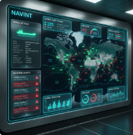
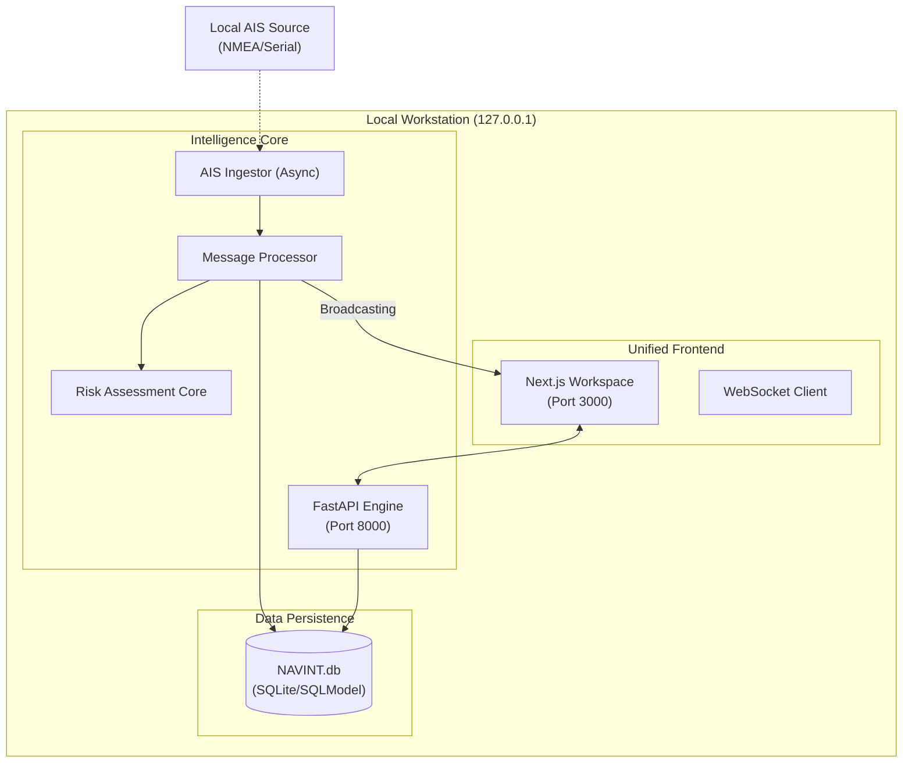

# 🛳️ NAVINT: Unified Maritime Intelligence Suite

<div align="center">
  
  <p><em>Secure. Localized. Unified. Premium Maritime Intelligence.</em></p>
</div>

[](https://www.python.org/downloads/release/python-3140/)
[](https://fastapi.tiangolo.com/)
[](https://nextjs.org/)
[](https://www.sqlite.org/)
[](#compliance)

**NAVINT** (Maritime Intelligence Predictive Platform) is a premium, local-first standalone application designed for Strategic Monitoring Cells. It provides a unified workspace for real-time vessel tracking, multi-factor risk assessment, and operational intelligence.

---

## 🌟 Key Features

-   **🎯 Unified Operational Dashboard**: A consolidated Next.js interface for monitoring, analytics, and signals—no more tool fragmentation.
-   **📡 Real-time AIS Ingestion**: Asynchronous NMEA processing with zero-latency local database persistence.
-   **⚖️ Autonomous Risk Engine**: Multi-factor weighted scoring based on vessel flag, behavior anomalies, and strategic proximity.
-   **🛡️ Strategic Geofencing**: Automated proximity alerts protecting critical maritime assets.
-   **📊 Real-time Broadcasting**: WebSocket-driven UI updates for live vessel movement and critical alert triage.
-   **📑 One-Click Reporting**: Integrated export engine for generating official CSV intelligence reports.

---

## 📸 Interface Preview

<div align="center">
  
  <p><em>High-fidelity Unified Operational Dashboard featuring reactive spatial intelligence.</em></p>
</div>

---

## 🖼️ Background & Visuals

<div align="center">
  
</div>

---

## 🏗️ System Architecture

The platform follows a **Unified Standalone Architecture** optimized for 16GB RAM local workstations.



---

## 💻 Technology Stack

| Layer | Technology | Rationale |
| :--- | :--- | :--- |
| **Logic** | **Python 3.14.2** | Latest async features and performance. |
| **API** | **FastAPI** | High-performance, type-safe REST & WebSockets. |
| **UI** | **Next.js (React)** | Premium UX, glassmorphism aesthetics, and custom mapping. |
| **Data** | **SQLite / SQLModel** | Local-first persistence with zero infrastructure overhead. |
| **Logs** | **Loguru** | Structured JSON logging for military-grade auditability. |

---

## 🚀 Getting Started

Launch the entire ecosystem with the automated build script:

```powershell
# 1. Initialize environment and install dependencies
.\build.cmd

# 2. Start the Backend Intelligence Engine
uvicorn app.main:app --reload --port 8000

# 3. Start the Unified Frontend Workspace
cd frontend
npm run dev
```

The dashboard will be available at `http://localhost:3000`.

---

## ⚖️ Compliance

This project strictly adheres to the **CONF23-STD-SDLC-NAVMIL** standard:
- **Security**: Local binding only (`127.0.0.1`), OWASP Top 10 Hardening.
- **Privacy**: No external telemetry; all data remains in the host workstation.
- **Performance**: Sub-8GB memory overhead during routine operations.

---

<div align="center">
  <p><strong>© 2026 CONFIANZA23 | USO OFICIAL</strong></p>
</div>
